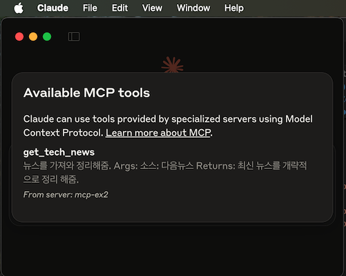

# MCP (Model Context Protocls) Examples

## 환경설정 with Visual Studio Code & Python
- reference: https://medium.com/data-science-collective/model-context-protocol-mcp-an-end-to-end-tutorial-with-hands-on-project-c6b9ffee03d7


### Package Manger install
- Pip 보다 uv package manager 사용 권장
 
    ```bash
    # MacOS / Linux
    curl -LsSf https://astral.sh/uv/install.sh | sh

    # Windows
    powershell -ExecutionPolicy ByPass -c "irm https://astral.sh/uv/install.ps1 | iex"
    ```

### 프로젝트 생성
- python & FastMCP
  ```bash
  uv init MCP-Ex2
  cd MCP-Ex2
  ```
### Virtual environment 생성 및 관련 패키지 설치
- venv, mcp & 필요한 패키지들
  ```bash
  # create virtual env
  uv venv
  
  # activate for macos/linux
  source .venv/bin/activate

  # activate for Windows
  .venv\Scripts\activate

  # install *libraries*
  uv add "mcp[cli]" httpx bs4 dotenv
  ```

### MCP server 작성
- main.py
    ```python
    from mcp.server.fastmcp import FastMCP
    from dotenv import load_dotenv
    import httpx
    import os

    from bs4 import BeautifulSoup
    import json

    load_dotenv()

    mcp = FastMCP("daum_news")
    USER_AGENT = "new-app/1.0"
    NEWS_SITES = {
        '다음뉴스' : "https://news.daum.net/"
    }

    async def fetch_news(url: str) :
        """다음뉴스 사이트에서 최신 뉴스를 가져와서 개략적으로 소개합니다."""
        async with httpx.AsyncClient() as client :
            try :
                response = await client.get(url, timeout=30.0)
                soup = BeautifulSoup(response.text, "html.parser")
                paragraphs = soup.find_all("p")
                text = " ".join([p.get_text() for p in paragraphs[:10]])
                return text
            except httpx.TimeoutException:
                return "Timeout error"
            
    @mcp.tool()
    async def get_tech_news(source: str) :
        """
        뉴스를 가져와 정리해줌.
        
        Args:
        소스: 다음뉴스
        
        Returns:
        최신 뉴스를 개략적으로 정리 해줌.
        """
        if source not in NEWS_SITES:
            raise ValueError(f"Source {source} is not supported")
        news_text = await fetch_news(NEWS_SITES[source])
        return news_text
                
                
    if __name__ == "__main__":
        mcp.run(transport="stdio")
    ```

### Claude for Desktop 설치
- MCP Host 임
- https://claude.ai/download

### HOST 설정 in Claude Desktop
- Claude App > Settings (Cmd + ,) > Edit Config
- 
- claude_desktop_config.json 이 있는 Finder (Exprlorer) 폴더 오픈됨
- 이 Config file 설정

    ```json
    {
        "mcpServers" : {
            "mcp-ex2" : {
                "command": "/opt/homebrew/bin/uv",
                "args": [
                    "--directory",
                    "/Users/hoseob/Documents/GitHub/mcp-ex2",
                    "run",
                    "main.py"
                ]
            }
        }
    }
    ```
- command 는 설치된 uv directory 정보로
    ```bash
    (MCP-Ex2) hoseob@Hoseobui-Macmini mcp-ex2 % which uv
    /opt/homebrew/bin/uv
    ```
- args 는 현재 서버가 소스가 있는 폴더와 소스파일 (main.py)

### HOST (Claude Desktop)
- 실행하면 config 에 있는 mcp server가 등록(Active)됨..
- 
- 

- 
- 
- 